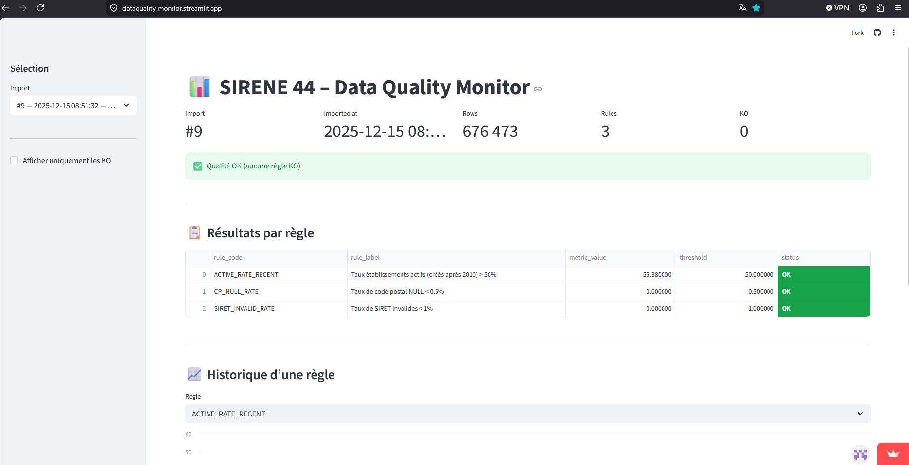

# sirene-dataquality-monitor

⚠️ Les données SIRENE ne sont pas incluses dans ce dépôt (volume important).

Application disponible :
https://dataquality-monitor.streamlit.app/

## Aperçu


Projet de **monitoring de la qualité des données** basé sur les données publiques **SIRENE (INSEE)**, limité aux établissements du **département 44 – Loire-Atlantique**.

L’objectif est de mettre en place un **pipeline data reproductible**, 100 % gratuit, orienté **Data Engineering / Analytics**, avec stockage PostgreSQL (Supabase) et visualisation via Streamlit.

---

## Objectifs

- Importer les données SIRENE (INSEE)
- Filtrer le périmètre au département 44
- Charger les données dans PostgreSQL (Supabase)
- Mettre en place un monitoring qualité structuré
- Suivre la qualité des données dans le temps

---

## Contexte métier

Ce projet s’inscrit dans une problématique classique de fiabilité des données utilisées pour l’analyse et la prise de décision.

Les données SIRENE, bien que référentielles, présentent des enjeux de qualité (complétude, validité, cohérence) qui peuvent impacter directement leur exploitation.

L’objectif est donc de mettre en place un dispositif de suivi de la qualité des données permettant d’identifier, mesurer et suivre les anomalies dans le temps, dans une logique proche de projets de migration ou de référentiels métiers.

---

## Fonctionnalités

- Ingestion de **CSV volumineux** (~8,8 Go)
- Filtrage géographique (département 44)
- Chargement robuste via **COPY PostgreSQL**
- Normalisation des données via **vues SQL**
- Règles de **Data Quality** formalisées et versionnées
- Historisation des imports
- Suivi de la qualité **dans le temps**
- Visualisation interactive via **Streamlit**
- Exposition de résultats lisibles pour analyse et démonstration

---

## Structure du projet

```
sirene-dataquality-monitor/
├── data/
│   ├── raw/                      # Données brutes INSEE (non versionnées)
│   └── processed/                # CSV filtré sirene_44.csv (non versionné)
├── ingest/
│   ├── filter_sirene_44.py       # Filtrage département 44
│   └── load_to_supabase.sh       # Import PostgreSQL (TRUNCATE + COPY)
├── sql/
│   ├── 001_view_v_sirene_44.sql
│   ├── 010_dq_checks.sql
│   ├── 020_view_v_sirene_44_analytics.sql
│   ├── 030_create_dq_results.sql
│   ├── 031_run_dq_rules.sql
│   ├── 040_create_import_runs.sql
│   └── 050_view_v_dq_by_import.sql
├── scripts/
│   └── run_pipeline.sh           # Orchestration complète du pipeline
├── streamlit_app/
│   ├── app.py                    # Application Streamlit
│   └── requirements.txt
├─ .github/
│  └─ workflows/
│     └─ keep-alive.yml
├── DEVELOPMENT.md                 # Documentation technique
├── .env.example
├── .gitignore
└── README.md
```

---

## Prérequis

- Python **3.10+**
- Client PostgreSQL (`psql`)
- Accès à une base PostgreSQL (Supabase)
- Environnement **Linux / WSL recommandé**

---

## Lancer le projet (quick start)

```bash
# 1. configurer les variables
cp .env.example .env

# 2. lancer le pipeline
bash scripts/run_pipeline.sh

# 3. lancer l'app
streamlit run streamlit_app/app.py

```

---

## Variables d’environnement

Créer un fichier `.env` (non versionné) à partir de `.env.example` :

```
DATABASE_URL=postgresql://<ADMIN_USER>:<PASSWORD>@<HOST>:5432/postgres
SIRENE_44_CSV=/chemin/absolu/data/processed/sirene_44.csv
```

Charger les variables :

```
set -a; source .env; set +a
```

---

## Données source

- **Jeu** : SIRENE – StockEtablissement
- **Source** : INSEE / data.gouv.fr
- **Format** : CSV UTF-8
- **Taille** : ~8,8 Go décompressé

Fichier attendu :

```
data/raw/StockEtablissement_utf8.csv
```

Les données ne sont **pas versionnées** (voir `.gitignore`).

---

## Pipeline de traitement

### Filtrage département 44

- Lecture du CSV SIRENE complet
- Filtrage sur `codePostalEtablissement LIKE '44%'`
- Écriture d’un CSV réduit (~676 000 lignes)

Script :
```
ingest/filter_sirene_44.py
```

---

### Base de données

- PostgreSQL hébergé sur **Supabase**
- Table brute : `sirene_44`
- Colonnes en **TEXT** (schéma identique au CSV)
- Import via **COPY PostgreSQL**

---

### Modélisation SQL

**Vue clean – `v_sirene_44`**

- Normalisation des noms de colonnes (`snake_case`)
- Chaînes vides converties en `NULL`
- Base stable pour transformations

**Vue analytics – `v_sirene_44_analytics`**

- Typage logique
- Indicateurs dérivés
- Flags métier et qualité

---

## Data Quality

### Approche Data Quality

Les règles de qualité sont définies selon des critères métiers et mesurées via des indicateurs (KPI).

Chaque règle est :
- explicitement définie
- versionnée en SQL
- historisée à chaque import

Cela permet un suivi structuré de la qualité des données dans le temps.

### Règles implémentées

- **ACTIVE_RATE_RECENT**  
  Taux d’établissements actifs (créés après 2010) ≥ 50 %

- **CP_NULL_RATE**  
  Taux de codes postaux NULL < 0,5 %

- **SIRET_INVALID_RATE**  
  Taux de SIRET invalides < 1 %

Les résultats sont stockés dans la table `dq_results` et historisés par import.

---

## Historisation

Chaque exécution du pipeline enregistre :

- Date d’import
- Fichier source
- Nombre de lignes
- Identifiant d’import

Cela permet un suivi **temporel** de la qualité des données.

---

## Gouvernance des données

Le dispositif s’inscrit dans une logique de gouvernance simplifiée :

- Data Owner : organisme source (INSEE)
- Data Steward : responsable du contrôle et du suivi de la qualité des données

Les anomalies sont identifiées, mesurées et suivies dans le temps via des indicateurs.

Cette approche permet de structurer la responsabilité et la gestion de la qualité des données dans un contexte opérationnel.

---

## Application Streamlit

Cette application permet de visualiser les indicateurs de qualité des données par import et d’analyser leur évolution dans le temps.

- Basée uniquement sur des **vues SQL**
- Sélection d’un import
- Statut global `OK / KO`
- Détail par règle

Lancement local :

```
streamlit run streamlit_app/app.py
```

---

## Sécurité

- Rôle PostgreSQL en **lecture seule**
- Aucune table brute exposée
- Accès via Session Pooler Supabase

---

## Roadmap / Améliorations

- Ajout de nouvelles règles Data Quality (fraîcheur, cohérence inter-champs)
- Paramétrisation des seuils par environnement (stockage des seuils dans une table dq_rule_config ou dans des variables)
- Orchestration via Airflow (planification hebdo et gestion des dépendances : filtrage → import → vues → DQ → historisation)
- Export des résultats DQ (export automatique en CSV après execution / exposition d'un endpoint FastAPI)
- Ajout de tests automatisés sur les règles SQL ?
- Ajout de nouvelles visualisations dans l’application Streamlit

---

## Choix techniques

- **PostgreSQL (Supabase)** : gratuit, robuste, SQL natif
- **COPY PostgreSQL** : performant sur gros volumes
- **Table brute + vues** : séparation ingestion / logique métier
- **Monitoring SQL versionné** : explicite et traçable
- **Streamlit** : simple, rapide, démonstratif

---

## Finalité

Ce projet vise à démontrer la mise en place d’un dispositif complet de fiabilisation des données :

- ingestion et structuration
- définition de règles de qualité
- suivi des indicateurs
- historisation et traçabilité

Ce type de dispositif est directement applicable à des contextes métiers (CRM, ERP, référentiels), où la qualité des données est un enjeu clé pour la fiabilité des analyses et des décisions.